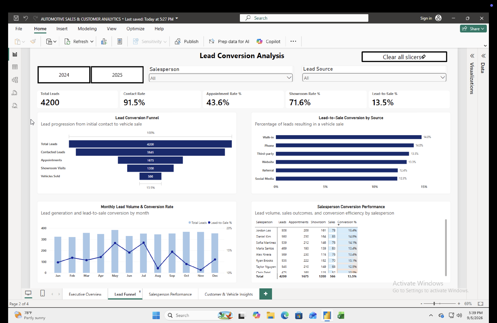
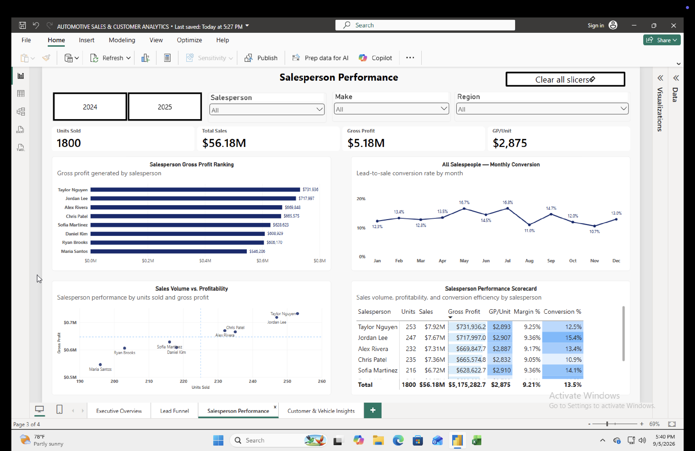
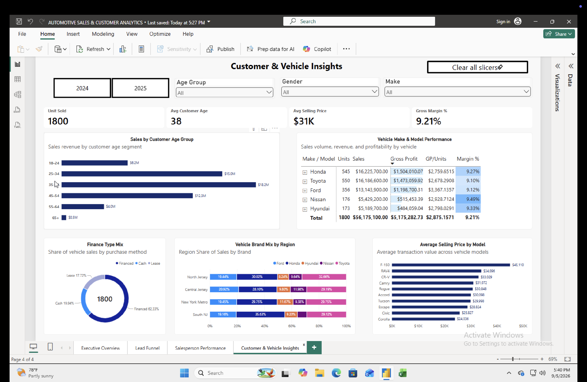

# Automotive Sales & Customer Analytics
Note: This project uses a synthetic dataset created for portfolio and educational purposes. It does not contain real customer or dealership information

## Project Overview

This Power BI project analyzes automotive sales and CRM-style lead data to evaluate revenue performance, profitability, lead conversion, salesperson performance, customer behavior, and vehicle purchasing trends.

The dataset contains:

- 1,800 vehicle transactions
- 4,200 sales leads
- 2024–2025 sales activity

## Tools Used

- Power BI
- Power Query
- DAX
- Data Modeling
- Microsoft Excel

## Dashboard Pages

### 1. Executive Overview
Provides an overview of revenue, unit sales, gross profit, margins, year-over-year performance, brand performance, regional sales, and vehicle profitability.


### 2. Lead Conversion Analysis
Analyzes the sales funnel from initial lead through contact, appointment, showroom visit, and completed vehicle sale.



### 3. Salesperson Performance
Compares salesperson sales volume, profitability, conversion efficiency, gross profit per unit, and monthly conversion trends.



### 4. Customer & Vehicle Insights
Analyzes customer age groups, financing behavior, vehicle preferences, regional patterns, and average selling price by model.



## Key Metrics

- Total Sales
- Units Sold
- Total Gross Profit
- Gross Margin %
- Average Selling Price
- Gross Profit per Unit
- Lead-to-Sale Conversion %
- Sales YoY %

## Data Modeling

The project uses a star-schema model with dimension tables for:

- Date
- Salesperson
- Lead Source

Fact tables include:

- Vehicle Sales
- Sales Leads

Relationships use one-to-many relationships from dimensions to fact tables.

## Key Insights

- **$56.18M in total vehicle sales** was generated across 1,800 transactions, producing **$5.18M in gross profit** and an overall **9.21% gross margin**.

- **Honda and Toyota were the highest-revenue brands**, each generating approximately **$16.2M in sales**, while the **Ford F-150 was the most profitable individual model**, generating approximately **$718K in gross profit**.

- The sales funnel converted **4,200 leads into 566 vehicle sales**, resulting in an overall **13.5% lead-to-sale conversion rate**. Walk-in leads performed best at **14.8%**, compared with **12.3% for Social Media**, the lowest-performing source.

- Salesperson performance varied depending on the KPI. **Taylor Nguyen generated the highest gross profit at approximately $732K**, while **Jordan Lee achieved the highest lead-to-sale conversion rate at 15.4%**, demonstrating the importance of evaluating both profitability and conversion efficiency.

- Customers aged **35–44 represented the highest-revenue age segment**, generating approximately **$18.2M in vehicle sales**, followed by customers aged 25–34 at approximately **$15.0M**.

- Financing was the dominant purchase method, accounting for approximately **62.3% of vehicle sales**, compared with **19.9% cash** and **17.7% lease transactions**.

- Vehicle preferences varied geographically. **Toyota represented the largest share of sales in North Jersey (32.7%)**, while **Honda represented 35.6% of South NJ sales**, illustrating differences in brand mix across regional markets.

- The **Ford F-150 had the highest average selling price at approximately $45.1K**, significantly above the overall average selling price of approximately **$31K**.

## Business Takeaways

The analysis highlights opportunities to improve automotive sales performance through lead-source optimization, salesperson benchmarking, customer segmentation, and vehicle mix analysis. Lead conversion varies by source and salesperson, while customer age, geography, financing preferences, and vehicle selection influence overall revenue and profitability.

The dashboard provides decision-makers with an interactive view of these factors to support sales strategy, marketing allocation, inventory planning, and performance management.

## Example DAX Measures

```DAX
Total Sales =
SUM(FactSales[SalePrice])

Total Gross Profit =
SUM(FactSales[FrontGrossProfit])

Gross Margin % =
DIVIDE(
    [Total Gross Profit],
    [Total Sales]
)

Lead-to-Sale % =
DIVIDE(
    [Sold Leads],
    [Total Leads]
)
