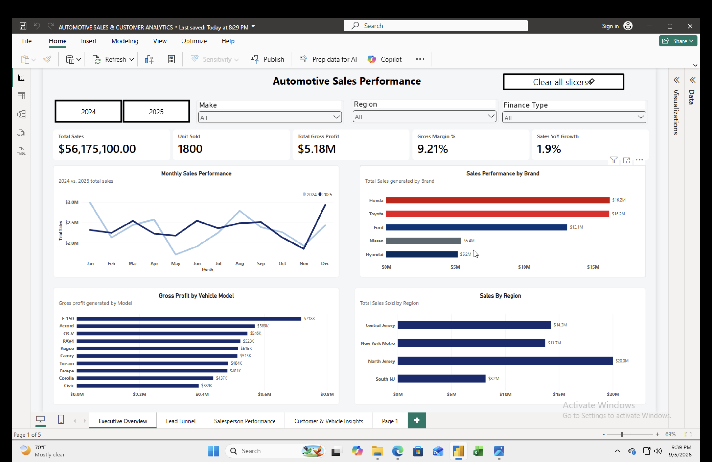

# Automotive Sales & Customer Analytics
Note: This project uses a synthetic dataset created for portfolio and educational purposes. It does not contain real customer or dealership information

## Project Overview

This Power BI project analyzes automotive sales and CRM-style lead data to evaluate revenue performance, profitability, lead conversion, salesperson performance, customer behavior, and vehicle purchasing trends.

The dataset contains:

- 1,800 vehicle transactions
- 4,200 sales leads
- 2024–2025 sales activity

## Tools Used

- Power BI
- Power Query
- DAX
- Data Modeling
- Microsoft Excel

## Dashboard Pages

### 1. Executive Overview
Provides an overview of revenue, unit sales, gross profit, margins, year-over-year performance, brand performance, regional sales, and vehicle profitability.



### 2. Lead Conversion Analysis
Analyzes the sales funnel from initial lead through contact, appointment, showroom visit, and completed vehicle sale.


### 3. Salesperson Performance
Compares salesperson sales volume, profitability, conversion efficiency, gross profit per unit, and monthly conversion trends.


### 4. Customer & Vehicle Insights
Analyzes customer age groups, financing behavior, vehicle preferences, regional patterns, and average selling price by model.


## Key Metrics

- Total Sales
- Units Sold
- Total Gross Profit
- Gross Margin %
- Average Selling Price
- Gross Profit per Unit
- Lead-to-Sale Conversion %
- Sales YoY %

## Data Modeling

The project uses a star-schema model with dimension tables for:

- Date
- Salesperson
- Lead Source

Fact tables include:

- Vehicle Sales
- Sales Leads

Relationships use one-to-many relationships from dimensions to fact tables.

## Example DAX Measures

```DAX
Total Sales =
SUM(FactSales[SalePrice])

Total Gross Profit =
SUM(FactSales[FrontGrossProfit])

Gross Margin % =
DIVIDE(
    [Total Gross Profit],
    [Total Sales]
)

Lead-to-Sale % =
DIVIDE(
    [Sold Leads],
    [Total Leads]
)
